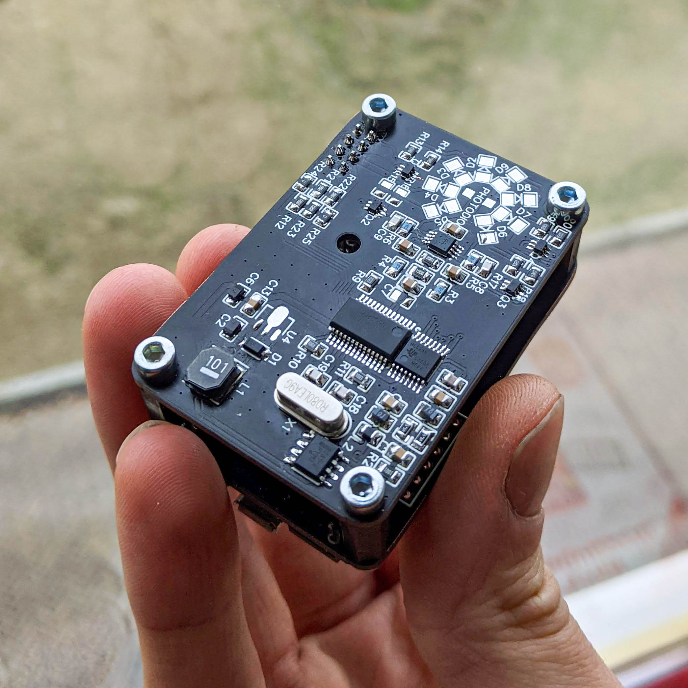

# Plastic Scanner.
This project aims to develop a simple handheld scanner that can detect five different types of plastic. At the end of the project, everything will be shared online so that also you can make one!

The working principle is based on [this paper](https://www.researchgate.net/publication/337868860_Identification_of_Plastic_Types_Using_Discrete_Near_Infrared_Reflectance_Spectroscopy) by Straller and Gessler. They already made the [reremeter](https://github.com/arminstr/reremeter), this is basically a more accessable version (bigger components, connection to a Raspberry Pi) and with a possibility of a few upgrades that resulted from their [issues](https://github.com/arminstr/reremeter/issues). 

More background information van be found on [PlasticScanner.com](https://plasticscanner.com)

 
 
 

## *This project is under development, it is not recommended to build the current hardware design (Jan 2021)* 

 
 
The hardware used in the project is under development but the goal is to run it on the following hardware:

The scanner PCB that contains the:
- [ADS1256 Analog to digital converter](https://www.ti.com/product/ADS1256)
- [SN74HCS238 Demultiplexer](https://www.ti.com/product/SN74HCS238)
- [plus the rest of the BOM]()

And the following peripherals:
- [Raspberry pi zero W](https://www.raspberrypi.org/products/raspberry-pi-zero-w/)
- [OLED screen](https://www.adafruit.com/product/938)
- Button
- [Battery management](https://www.adafruit.com/product/2465) if you want to make it portable

 

 

# To Do
- [ ] Fix issues with current PCB design
- [ ] Build correct training model with Tensorflow 2 and export model
- [ ] Write main python file for data capture and prediction

